# BGlab3

| 姓 名 | 杨力泉 |
|-------|-------------|
| 学 号 | 231220069 |
| 日 期 | 2026 年 5 月 4 日 |

---

## 一、本地实验环境

- 操作系统：Ubuntu 22.04（WSL2）  
- JDK 版本：OpenJDK 1.8.0_281  
- Hadoop 版本：3.2.1  
- HBase 版本：2.4.0  
- 硬件配置：vCPU2核，内存4GB，硬盘30G  
- 平台环境：集群环境（实验平台）

---

## 二、任务一：基于 HBase 的用户画像管理

### 2.1 设计思路

- 本任务要求使用 HBase Shell 创建用户画像表并进行 CRUD 操作。核心设计如下：
  - 表名：`user_profile`
  - RowKey：`user_id`（用户ID）
  - 列族：`base_info`（基础信息）和 `social_stats`（社交数据），将静态属性与动态属性分离。
  - 利用 HBase 的**稀疏存储**特性，不同用户可拥有不同的列；利用**动态列扩展**特性，为特定用户直接新增 `phone` 字段而不需修改表结构。

### 2.2 操作步骤与结果截图

**① 建表**
创建包含 base_info 和 social_stats 两个列族的表。
- 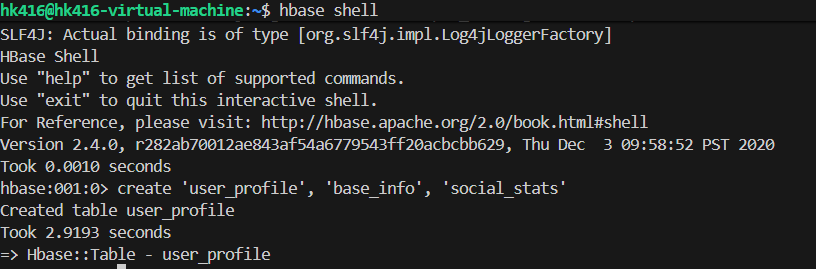

**② 插入数据**
向 u001、u002、u003 插入测试数据，其中 u003 无粉丝数记录。
- 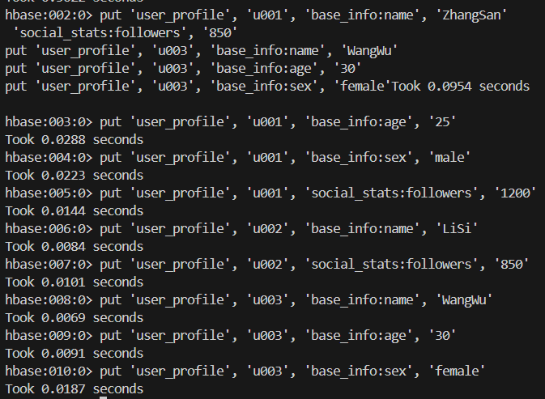
数据插入后的结果展示：
- 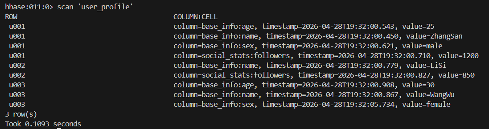

**③ 粉丝数查询**
扫描有 social_stats 列族数据的用户，体现了稀疏存储：u101 无此列族信息则不返回。
- 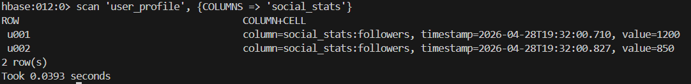

**④ 动态新增字段及精确查询**
为 u001 用户动态新增 base_info:phone 字段，并通过 Get 命令精确查询。
- 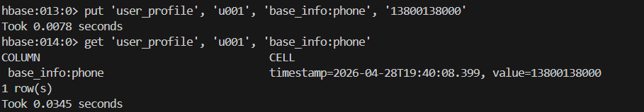
- 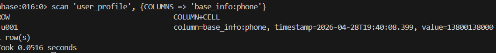

**⑤ 删除表**
实验结束后禁用并删除 user_profile 表。
- 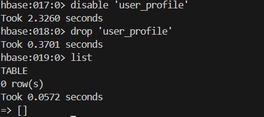

---

## 三、任务二：基于 MapReduce 的播放时长统计

### 3.1 设计思路与核心代码

- **核心目标**：统计各个视频分区下，所有播放行为（action_type=1）的总播放时长。
- **Mapper 设计**：读取日志行，按空格切分，过滤 action_type='1' 的记录，输出 `<video_category, play_duration>`。
- 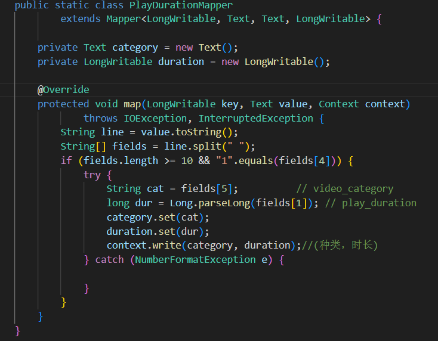
- **Reducer 设计**：对同一视频分区的所有 play_duration 累加求和，输出 `<video_category, total_duration>`。
- 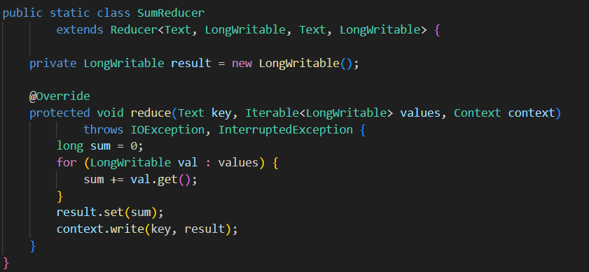

### 3.2 MapReduce 提交
提交：
- 
- 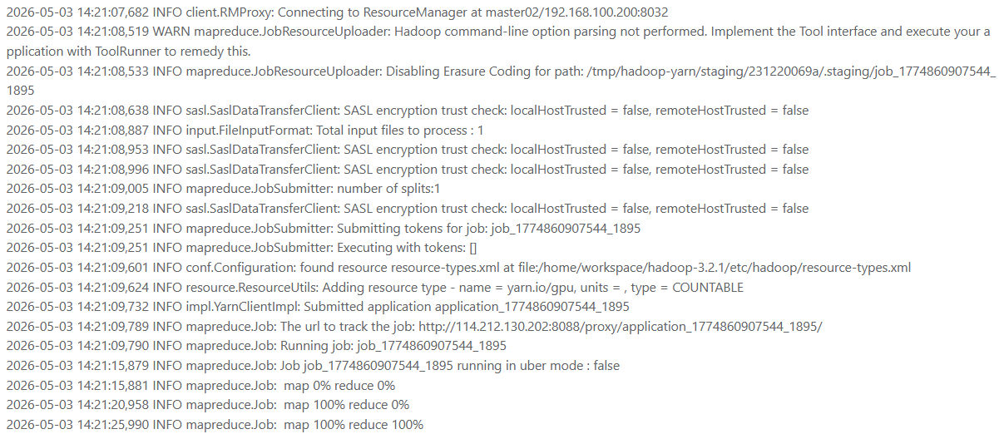
YARN Web 监控界面：
- 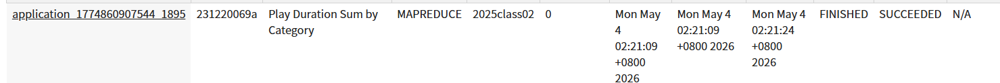
### 3.3 Hive 外部表挂载验收与执行结果

为了验证 MapReduce 输出结果，创建了 Hive 外部表指向 HDFS 输出目录：
- 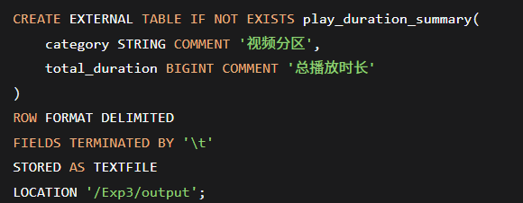
通过 SQL 查询验证统计结果是否正确：
- 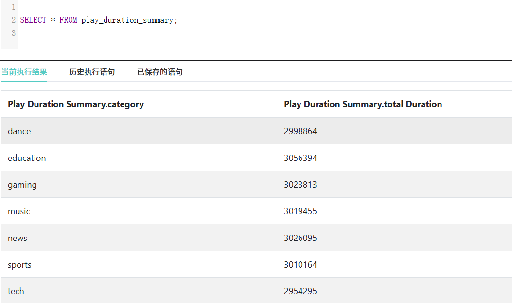

---

## 四、任务三：基于 Hive 的数仓分层与 HQL 数据分析

### 4.1 设计思路

- **数据源映射**：创建外部表 `behavior_log_raw` 挂载 HDFS 日志，确保不移动原始文件。
- **分区表优化**：创建 `log_part` 表，以 `video_category` 为分区键，使后续按分区的查询裁剪数据。
- **分桶表优化**：创建 `log_bucket` 表，按 `video_id` 分 3 个桶，为后续可能的表连接 (JOIN) 或抽样 (SAMPLE) 提供更高效的物理存储。
- **业务查询**：基于 `log_part` 表执行三类典型需求：分区过滤查询、用户设备风控统计、分区点赞聚合。

### 4.2 操作步骤与结果截图

**① 创建原始数据外部表**
- 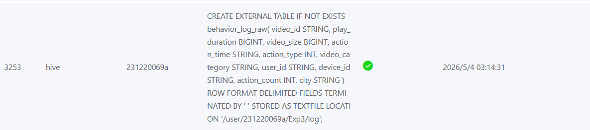

**② 创建视频分区分区表**
- 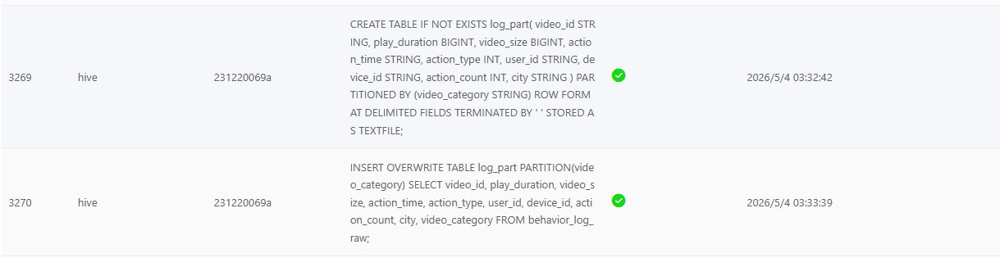

**③ 创建视频ID分桶表**
- 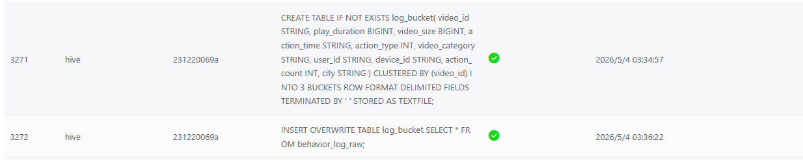

**④ 业务查询 A：查询科技区（tech）数据**
- 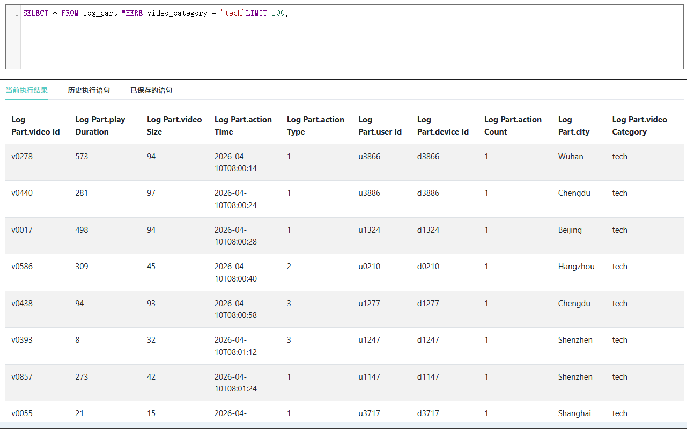

**⑤ 业务查询 B：统计每个用户的不同设备数**
- 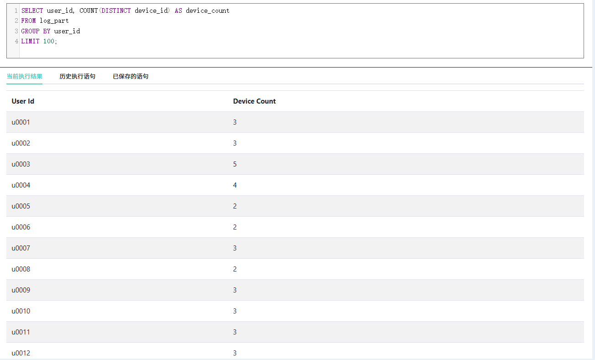

**⑥ 业务查询 C：统计各分区点赞总数**
- 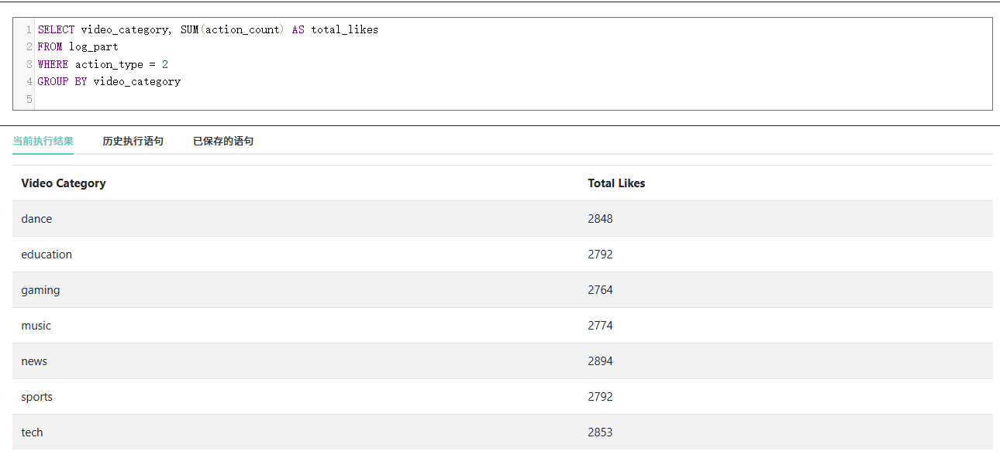

---

## 五、附件说明

**压缩包 231220069_杨力泉_BGlab3.zip 包含：**
- 源代码：PlayDurationSum.java 
- JAR 包：playduration.jar
- 实验报告：本文件
- 任务一结果文件