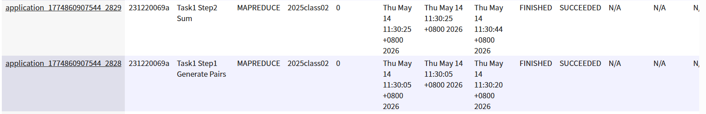
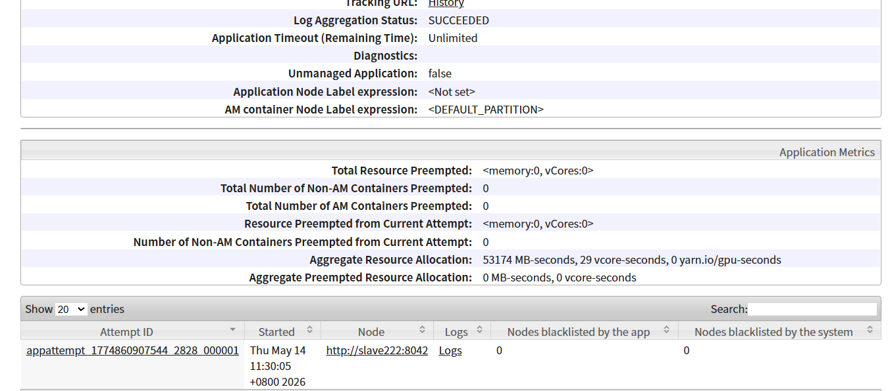
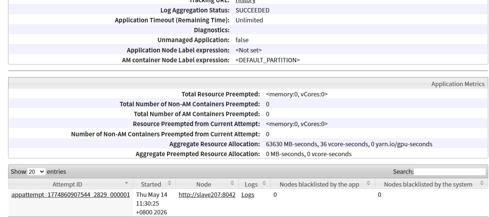
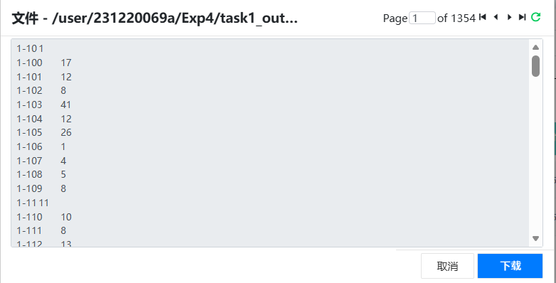
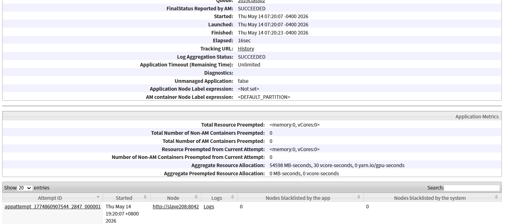
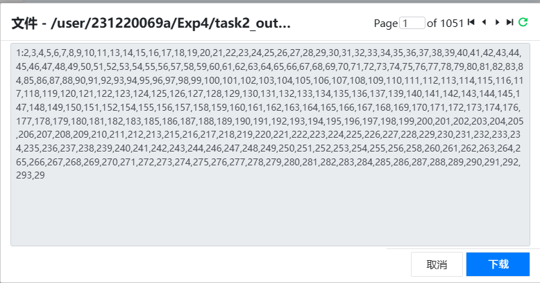
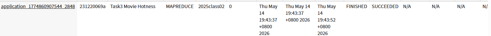
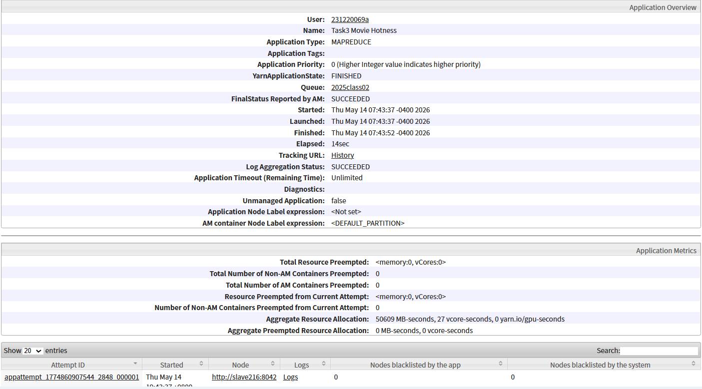
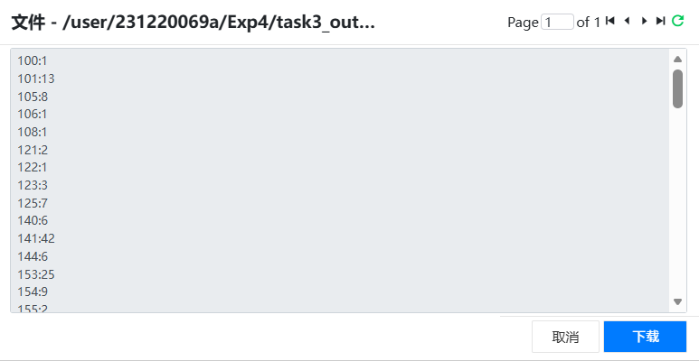

# 大数据处理综合实验课程

## 实验四：MapReduce 高级编程技术

| 姓 名 | 杨力泉 |
|-------|-------------|
| 学 号 | 231220069 |
| 日 期 | 2026 年 5 月 14 日 |

---

## 一、本地实验环境

- 操作系统：Ubuntu 22.04（WSL2）  
- JDK 版本：OpenJDK 1.8.0_281  
- Hadoop 版本：3.2.1  
- 硬件配置：vCPU2核，内存4GB，硬盘30G  
- 集群环境：课程实验平台  

---

## 二、任务一：统计喜欢相同电影的用户

### 2.1 设计思路

**目标**：找出所有共同喜欢电影的用户对，并统计他们共同喜欢的电影数量。  
**输入**：`ratings.csv`（userId, movieId, rating, ...），rating ≥ 4.0 视为喜欢。  
**输出**：`A-B  N`，其中 A < B，N 为共同喜欢电影数。

采用**两个串联 MapReduce 作业**实现：

- **Job1**：生成每对喜欢同一部电影的用户对，每个用户对输出计数值 1。
  - **Mapper**：过滤 rating ≥ 4.0 的记录，输出 `<movieId, userId>`。
  - **Reducer**：对同一 movieId 的用户列表排序，生成所有无序对 `A-B`，输出 `<A-B, 1>`。
- **Job2**：将 Job1 的临时结果按用户对聚合求和。
  - **Mapper**：读取 `<A-B, 1>`，恒等输出。
  - **Reducer**：对相同的用户对累加计数，得到最终 N。

**Key/Value 类型**：

| 作业 | 阶段 | Key          | Value        |
|------|------|--------------|--------------|
| Job1 | Map  | Text(movieId) | Text(userId) |
| Job1 | Reduce | Text(A-B)    | IntWritable(1) |
| Job2 | Map  | Text(A-B)    | IntWritable  |
| Job2 | Reduce | Text(A-B)    | IntWritable(N) |

### 2.2 核心伪代码

```java
// Job1 Mapper
map(key, value):
    fields = value.split(",")
    if fields[2] >= 4.0:
        emit(fields[1], fields[0])

// Job1 Reducer
reduce(movieId, users):
    sort(users)
    for i in 0..len-1:
        for j in i+1..len-1:
            pair = users[i] + "-" + users[j]
            emit(pair, 1)

// Job2 Reducer
reduce(pair, counts):
    sum = 0
    for c in counts: sum += c
    emit(pair, sum)
```

### 2.3 作业提交与执行
```提交命令
yarn jar Task1.jar Task1 \
    /user/root/Exp4/ratings.csv \
    /user/231220069a/Exp4/task1_output
```
集群提交过程截图：



YARN WebUI 执行报告（两个 Job 均成功）：



### 2.4 输出结果

HDFS 输出路径：`/user/231220069a/Exp4/task1_output`  
部分结果截图：


---

## 三、任务二：有相同喜好的用户

### 3.1 设计思路

**目标**：基于任务一的输出，生成每个用户的同好列表，格式 `A:B,C,D`，好友 ID 按数值升序排列。  
**输入**：任务一输出 `A-B \t N`。  
**输出**：`A:B,C,D...`

采用**一个 MapReduce 作业**完成：

- **Mapper**：解析 `A-B \t N`，双向输出 `<A, B>` 和 `<B, A>`，使用 `IntWritable` 作为 Key，保证 Shuffle 按用户 ID 数值排序。
- **Reducer**：对同一用户的所有好友使用 `TreeSet<Integer>` 去重并数值排序，最后拼接为 `用户ID:好友1,好友2,...` 输出。
- 设置 `setNumReduceTasks(1)`，使输出文件内部整体有序。

**Key/Value 类型**：

| 阶段 | Key               | Value        |
|------|-------------------|--------------|
| Map  | IntWritable(用户) | Text(好友)   |
| Reduce | 输出: Text(整行)  | Text(空)     |

### 3.2 核心伪代码

```java
// Mapper
map(key, line):
    parts = line.split("\t")
    users = parts[0].split("-")
    if users.length == 2:
        emit(IntWritable(users[0]), Text(users[1]))
        emit(IntWritable(users[1]), Text(users[0]))

// Reducer
reduce(userId, friends):
    TreeSet<Integer> set
    for f in friends: set.add(Integer.parseInt(f))
    out = userId + ":" + join(set, ",")
    emit(out, "")
```

### 3.3 作业提交与执行
提交命令
```
yarn jar Task2FromTask1.jar Task2FromTask1 \
    /user/231220069a/Exp4/task1_output \
    /user/231220069a/Exp4/task2_output
```
集群提交过程截图：


YARN WebUI 执行报告：


### 3.4 输出结果

HDFS 输出路径：`/user/231220069a/Exp4/task2_output`  
部分结果截图：


---

## 四、任务三：统计电影热度

### 4.1 设计思路

**目标**：统计 `top100.csv` 中 100 部电影各自有多少人喜欢（rating ≥ 4.0）。  
**输入**：`ratings.csv` 和 `top100.csv`（通过 DistributedCache 分发）。  
**输出**：`电影ID:喜欢人数`。

采用**一个 MapReduce 作业**：

- **Mapper.setup()**：从 DistributedCache 读取 `top100.csv`，将 100 个电影 ID 存入 HashSet。
- **Mapper.map()**：过滤 rating ≥ 4.0 且电影 ID 在 top100 集合中的记录，输出 `<movieId, 1>`。
- **Reducer**：对每个电影 ID 的计数求和，输出 `电影ID:总人数`。

**Key/Value 类型**：

| 阶段 | Key          | Value        |
|------|--------------|--------------|
| Map  | Text(movieId) | IntWritable(1) |
| Reduce | 输出: Text(F:N) | Text(空) |

### 4.2 核心伪代码

```java
// setup()
for cacheFile in getLocalCacheFiles():
    if "top100.csv":
        read lines → topSet.add(movieId)

// map()
if rating >= 4.0 and movieId in topSet:
    emit(movieId, 1)

// reduce()
sum = 0
for v in values: sum += v
emit(movieId + ":" + sum, "")
```

### 4.3 作业提交与执行

提交命令（通过 `-files` 将 top100.csv 加入缓存）：
```bash
yarn jar Task3.jar Task3 \
    -files hdfs:///user/root/Exp4/top100.csv#top100.csv \
    /user/root/Exp4/ratings.csv \
    /user/231220069a/Exp4/task3_output
```
集群提交过程截图：



YARN WebUI 执行报告：


### 4.4 输出结果

HDFS 输出路径：`/user/231220069a/task3_output`  
部分结果截图：


---

## 五、附件说明

**压缩包 `231220069_杨力泉_BG_4.zip` 包含：**

- 源代码：`Task1.java`、`Task2FromTask1.java`、`Task3.java`
- JAR 包：`Task1.jar`、`Task2FromTask1.jar`、`Task3.jar`
- 实验报告：`231220069_杨力泉_BG_4.pdf`
- 运行方式：`README.md`

---
